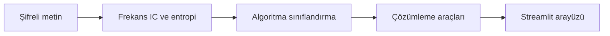

<div align="center">

# AI Cryptanalyst

### Şifreli metnin izini sür.


[](LICENSE)

Şifreli metinler için algoritma tahmini ve çözümleme araçlarını Streamlit arayüzünde bir araya getiren eğitim uygulaması.

**Metin analizi ve kriptanaliz**

[Projeyi keşfet](https://github.com/silanpehlivan/AI-Cryptanalyst/tree/main) · [Kurulum ve ayrıntılar](#projeyi-çalıştırmak-ve-incelemek)

</div>

---

## İçeride neler var?

- **01** · Caesar, Vigenere ve XOR çözümleme araçları
- **02** · Base64 kod çözümü, entropi ve IC analizi
- **03** · Veri üretimi, model eğitimi ve doğrulama

## Projeyi çalıştırmak ve incelemek

<details>
<summary><strong>Kurulum, kod yapısı ve teknik notları aç</strong></summary>

## Öne Çıkanlar

- Caesar, Vigenere ve XOR çözümleme araçları
- Base64 kod çözümü, entropi ve IC analizi
- Veri üretimi, model eğitimi ve doğrulama

## Teknolojiler

Python · Streamlit · Machine Learning

### Teknik yaklaşım

Harf frekansları, coincidence index ve entropi metin özelliklerini oluşturur. Model eğitimi ile Caesar/Vigenere/XOR çözücüleri ayrı betiklerde incelenebilir.



### Kodu incelemeye başlayın

- [app.py](app.py)
- [main_solver.py](main_solver.py)
- [solvers.py](solvers.py)
- [test_solvers.py](test_solvers.py)

### Kapsam ve sınırlar

Eğitim araçlarıdır; modern kriptografiyi genel olarak kırma iddiası içermez. evaluate_model.py tüm CSV üzerinde değerlendirme yaptığı için bağımsız test sonucu olarak sunulmaz.


[](LICENSE) [](https://streamlit.io/) [](https://www.python.org/)

AI Cryptanalyst, Yapay Zeka destekli bir kripto çözücü uygulamasıdır. Streamlit tabanlı görsel kullanıcı arayüzü üzerinden şifreli metinleri analiz eder, en uygun şifreleme algoritmasını tahmin eder ve çözümünü sağlar.

## Öne çıkanlar

- Otomatik şifre tespiti ve çözümleme
- Caesar, Vigenere, XOR ve Base64 destekli
- Metin analizi için Entropi ve IC hesaplama
- Model eğitimi, değerlendirme ve doğrulama araçları
- Kullanıcı dostu Streamlit arayüzü

## Özellikler

- `Caesar` (Sezar) şifre çözümü
- `Vigenere` şifre çözümü
- `XOR` tabanlı şifre çözümü
- `Base64` kod çözümü
- Entropi hesaplama
- İndeks of Coincidence (IC) analizi
- Model eğitim ve doğrulama süreçleri

## Nasıl çalışır?

1. Kullanıcı şifreli metni girer.
2. Model ve algoritmalar metni analiz eder.
3. En olası şifreleme türü tespit edilir.
4. Şifreli metin çözülür ve kullanıcıya sunulur.

## Dosya yapısı

- `app.py`: Streamlit uygulaması
- `main_solver.py`: Ana kriptanaliz sınıfı ve çözümleyici
- `solvers.py`: Şifre çözümleme algoritmaları
- `train_model.py`: Model eğitim scripti
- `evaluate_model.py`: Eğitilmiş modeli değerlendirme
- `verify_model.py`: Model doğrulama scripti
- `verify_vigenere.py`: Vigenere doğrulama aracı
- `data_generator.py`: Veri seti oluşturma ve işleme
- `utils.py`: Yardımcı fonksiyonlar
- `crypto_dataset.csv`: Kullanılan eğitim/veri seti

## Kurulum

1. Proje dizinine gidin:

```bash
cd AI-Cryptanalyst
```

2. Gerekli kütüphaneleri yükleyin:

```bash
pip install -r requirements.txt
```

3. Uygulamayı çalıştırın:

```bash
streamlit run app.py
```

## Notlar

Bu proje, kriptanaliz algoritmalarını ve makine öğrenmesi tabanlı yaklaşımı birleştirerek karmaşık şifrelenmiş metinleri otomatik olarak çözmeyi hedefler.

---


</details>

---

<div align="center">

**© 2026 Şilan PEHLİVAN**

Bu proje MIT lisansı kapsamında sunulmaktadır. Kullanım ve dağıtım koşulları: [LICENSE](LICENSE).

</div>
